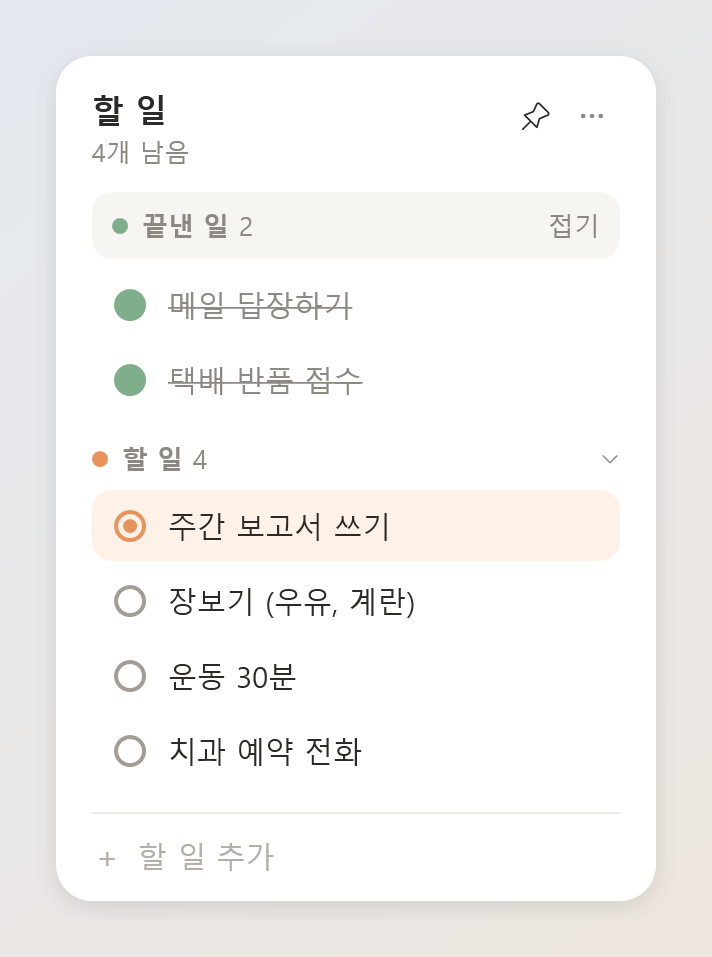
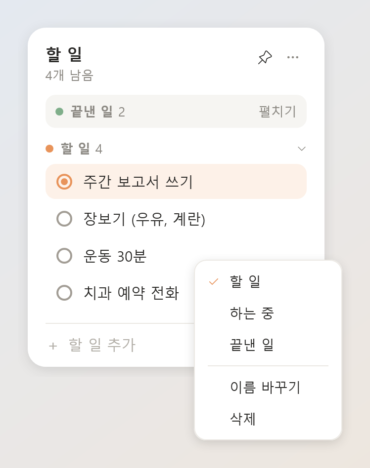
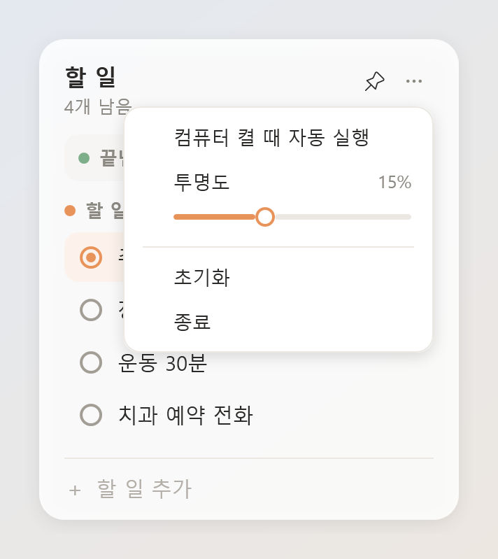
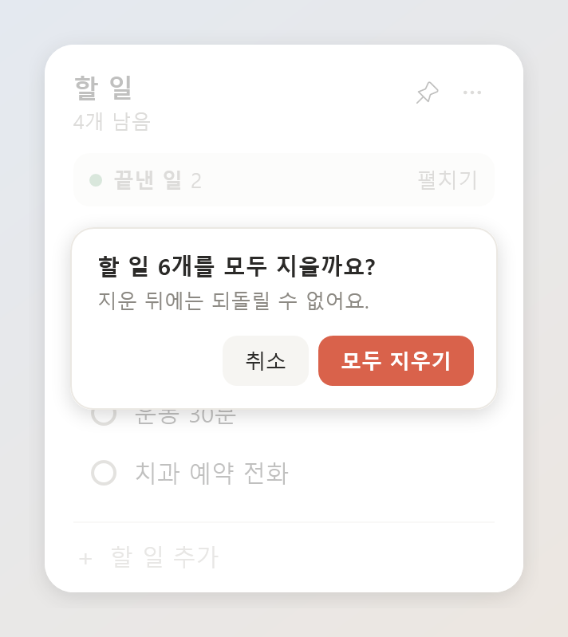

# TodoWidget

A small, always-on to-do widget for Windows and macOS. It floats on your desktop and shows at a glance how much is left to do.

The widget follows your system language: Korean, English, German, or Simplified Chinese.

<p align="center">
  
</p>

The screenshots show v1.4 with the Korean UI. v2.0 looks almost the same.

## Install

### Windows 10/11 (x64)
Using v1.4? Quit it first — see [Upgrading from v1.4](#upgrading-from-v14-windows).

1. Download `TodoWidget_<version>_x64-setup.exe` from the [latest release](https://github.com/HoyeongJeon/todo-widget/releases/latest).
2. Run it. If Windows shows "Windows protected your PC" (SmartScreen), click **More info** → **Run anyway**. The installer is not code-signed.
3. It installs for your user only. No administrator rights are needed.

If the WebView2 runtime is missing (some Windows 10 PCs), the installer adds it for you (needs an internet connection).

To uninstall, go to **Settings → Apps → Installed apps** (on Windows 10, **Settings → Apps → Apps & features**). This also removes the auto start entry. Your data folder is kept.

### macOS 13 or later (Apple Silicon and Intel)
1. Download `TodoWidget_<version>_universal.dmg` from the [latest release](https://github.com/HoyeongJeon/todo-widget/releases/latest).
2. Open it and drag **TodoWidget** into **Applications**.
3. Open it from Applications. macOS blocks the first launch because the app is not notarized. Go to **System Settings → Privacy & Security** and click **Open Anyway**. After that it opens normally.

Do not run the app from inside the dmg. Move it to Applications first.

To uninstall, move TodoWidget from Applications to the Trash. Your data folder is kept.

## Upgrading from v1.4 (Windows)

v1.4 was a zip with a single `TodoWidget.exe`. v2.0 comes with an installer.

1. Quit v1.4 first: open the ⋯ menu and click **종료** (Quit). If both widgets run at the same time, they can overwrite each other's saves.
2. Install v2.0 as described above and open it.

Your tasks, window position, size, pin state, and transparency carry over. v2.0 stores tasks in a new file format. Before it converts your file, it keeps a copy of the old one as `tasks.v1-backup-<date>-<time>.json` in `%APPDATA%\TodoWidget\`.

If auto start was on in v1.4, it now starts v2.0 instead. If you had turned it off, it stays off.

After that, you can delete the folder where you unzipped v1.4.

If you forgot to quit v1.4 and both widgets are open, quit v1.4 with ⋯ → **종료**. The two look the same; if you can't tell which is v1.4, quit both and start TodoWidget again from the Start menu (that is v2.0). Even if you leave v1.4 running, only v2.0 starts at your next login.

### Going back to v1.4

v1.4 cannot read the v2 file format. If you run v1.4 after v2.0, it treats the file as broken, renames it to `tasks.broken-….json`, and starts with an empty list. Nothing is deleted.

To go back:
1. Quit v2.0 (⋯ → **Quit**) and uninstall it. Otherwise it starts at your next login and converts the file again.
2. In `%APPDATA%\TodoWidget\`, move the current `tasks.json` out of the way (move it to another folder or rename it).
3. Rename `tasks.v1-backup-….json` to `tasks.json`. If there are several, use the newest one.
4. Run v1.4. If you deleted it, download `TodoWidget-win-x64.zip` again from the [v1.4.0 release](https://github.com/HoyeongJeon/todo-widget/releases/tag/v1.4.0).

Changes you made in v2.0 are not included. v1.4 reads `settings.json` as it is. To have v1.4 start at login again, turn auto start back on from its ⋯ menu: **컴퓨터 켤 때 자동 실행** ("Run automatically when the computer turns on").

## Features

- **Three states, two sections.** Click the circle to move a task from *To do* to *In progress* to *Done*. In-progress tasks stay in the to-do list, highlighted in orange at the top.
- **Always-visible input.** Type a task at the bottom and press Enter. The box stays open, so you can add several in a row. Esc clears what you typed.
- **Paste a list.** Paste multiple lines and each line becomes its own task. Blank lines are skipped, and a leading `-` or `•` bullet is removed.
- **Right-click menu.** Jump straight to any state (for example, finish a task in one step), rename, or delete. On macOS, Control-click works too. You can also double-click a title to rename it.
- **Done on top, folded.** Finished tasks sit at the top in a *Done* row that stays folded until you open it. The most recently finished task is listed first.
- **Fold the list.** Click the *To do* title to fold it down to one line. The count stays visible.
- **Resizable.** Drag any edge or corner. The height you drag to becomes a limit: with few tasks the widget stays small, and with many it stops there and scrolls.
- **Separate scrolling.** With the done list open, *Done* and *To do* scroll on their own. A short section stays fully visible, and long sections share the remaining space.
- **Background transparency.** Drag the slider in the ⋯ menu (or scroll over it) to make the card 0–40% see-through. The change shows as you drag. Only the background fades, so text stays crisp.
- **Clear all.** ⋯ → **Clear all** deletes every task after you confirm in the widget. Your settings stay as they are.
- **Pin on top.** Toggle always-on-top with the pin button.
- **Remembers its place.** Position, size, transparency, pin state, and fold state are restored on the next launch.
- **Starts at login.** Auto start is turned on at the first run. Turn it off or on with ⋯ → **Open at login**. Windows uses the Run key in the registry. macOS uses a login item.
- **Single instance.** Opening it again brings the existing widget to the front.
- **Out of the way.** On Windows there is no taskbar button and no tray icon. On macOS there is no Dock icon. A menu bar icon brings the widget to the front, and right-clicking it shows **Open** and **Quit**.
- **Follows you on macOS.** The widget shows on every desktop (Space). It hides while another app is in full screen.

| Right-click a task | ⋯ menu | Clear all |
|:---:|:---:|:---:|
|  |  |  |

## Updates

The widget checks for a new version when it starts and once a day. When one is available, a line at the bottom says so; click **Update** to install it and restart. Nothing is downloaded until you click.

If the check fails, for example when you are offline, nothing is shown and the widget keeps working. Updates are signed, and the widget refuses to install one whose signature does not match.

## Privacy

Your tasks and settings never leave your computer. The widget only connects to the internet to read the public `latest.json` file of this repository's latest release (to see whether there is a new version) and, when you click **Update**, to download it.

## Where your data lives

- Windows: `%APPDATA%\TodoWidget\`
- macOS: `~/Library/Application Support/TodoWidget/`

Tasks are in `tasks.json` and settings are in `settings.json`, both plain JSON. Uninstalling the app does not delete this folder.

## Build from source

You need:
- Node.js 22.18 or later
- pnpm 10.33.2 through corepack: `corepack enable`
- Rust. `rustup` picks the version in `rust-toolchain.toml`.
- The [Tauri v2 prerequisites](https://v2.tauri.app/start/prerequisites/) for your OS

Set `TODOWIDGET_DATA_DIR` to a test folder while developing, so your real tasks are not touched.

```sh
pnpm install
pnpm tauri dev
pnpm test
```

The behavior spec lives in `spec/` (in Korean). Start at `spec/README.md`. Design notes and plans are in `docs/superpowers/` (also in Korean).
